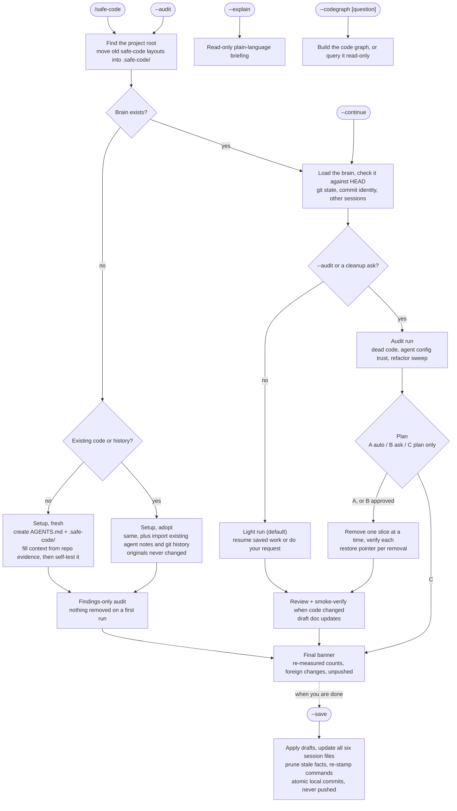

# safe-code v5.0

> **Project memory that checks itself, for every coding agent.**

[](./skills/safe-code/SKILL.md)
[](#host-support)
[](./LICENSE)

safe-code is an agent skill. It gives your project one `AGENTS.md` entry point and one `.safe-code/` folder that every coding agent reads the same way, so a new chat starts where the last one stopped instead of re-scanning the repo or guessing.

- **Memory that checks itself.** Each important fact in the context files is tagged with the file or command it came from; anything that can't be proven is recorded as an Open Question. After writing the context, a closed-book self-test checks that it can answer the basics a new agent asks. Commands in `AGENTS.md` carry the commit they last ran green at. The brain is stamped with a git commit, checked for drift on every run, and kept within a line budget.
- **Briefs your agent automatically at session start.** With the optional Claude Code hook, every new session opens with a short brief (what the project is, the next action, open questions, a stale-brain warning), and you see a one-line reminder only when the last session left work unsaved.
- **Safe with other agents and teammates in the same repo.** It never pushes, never reverts changes another session made, and stages only the paths its own run touched. In a shared repo, the brain is committed and each developer's session files stay local. Every deletion gets a restore pointer in a restore log.
- **Careful cleanup, when you ask for it.** `/safe-code --audit` runs dead-code audits with evidence, refactors with impact checks, a review that checks your standards and the spec separately, and atomic local commits. A normal run only resumes your work.

---

## Install

```bash
npx skills add afu-it/safe-code        # into the current project
npx skills add afu-it/safe-code -g     # globally (all projects)
npx skills add afu-it/safe-code --list # preview first

npx skills update                      # update a project install
npx skills update -g                   # update a global install (-g is required)
```

Works with Codex, Claude Code, Cursor, Windsurf, and 40+ other agents that load skills. A global install lives in `~/.agents/skills/safe-code/`; a project install goes into your agent's project skills folder (for example `.agents/skills/safe-code/`).

---

## Quick start

| Command | What it does |
|---|---|
| `/safe-code` | First run: set up the brain. Later: a light run that loads the brain, resumes saved work, and does what you ask |
| `/safe-code --continue` | Resume saved unfinished work explicitly |
| `/safe-code --audit` | Full hygiene pass: dead-code audit, agent config trust audit, refactor sweep |
| `/safe-code --save` | Finalize docs, update the six session files, commit locally (never pushes) |
| `/safe-code --explain` | Read-only: explain the project back in plain language |
| `/safe-code --codegraph [question]` | Build an optional code graph (codegraph), or ask it a question (read-only). `--graphify` still works as an alias |

Forgot `--continue`? `/safe-code` detects saved unfinished work and resumes anyway. Asking for a cleanup, a dead-code hunt, or a refactor sweep in any language ("clean up the repo", "find dead code") starts the same pass as `--audit`; a targeted ask ("fix this bug", "rename X") stays a light run. In a project that already has `.safe-code/`, a bare flag (`--save`, `--continue`, `--audit`, `--explain`, `--codegraph`) is enough.

---

## What you'll see

First run in an existing project:

```text
you> /safe-code
[safe-code: no project brain — initializing now]

Project root: my-app/  ·  safe-code folder: .safe-code/
AGENTS.md: populated  ·  CLAUDE.md bridge: created
context/: created, populated from repo evidence  ·  current-issues.md: gitignored
Session files: 6 created  ·  Legacy: none
Imported: CLAUDE.md, .cursorrules, 3 ADRs linked (11 facts, 2 open questions)  ·  History: 200 commits read
All paths inside project root. Proceeding.

=== safe-code v5.0 session complete ===
Run: setup (adopt) · Coverage: ~85% · profile: Audit · mode: C
Git: repo found | 214 commits | branch: main | Remote: none [Bucket C] | Save: local commit only; no push | Commits: pending — run /safe-code --save
Brain: 186 lines (budget 300)
context_selftest: 9/10 pass · 0 weak · 1 open · 0 fail · 4 commands re-verified (read-only), 0 stale, 1 manual (2026-10-04)
Flagged: 2 dead-code candidates (findings only; nothing removed on a first run)
Task list: 12/12 · Parked: none · Abandoned: none · Requested: none declared · Out-of-scope touches: none
Worth asking next: Is the staging deploy target still in use?
Run /safe-code --save to commit and close this session.
```

A later session (light run), after an earlier one was saved with work still pending:

```text
you> /safe-code
[safe-code: brain loaded @ 3f9c2e1]
Saved safe-code session found; resuming automatically. Say "fresh pass" to ignore saved state.
Pending: add CSV export to the reports page | Next: add CSV export to the reports page

=== safe-code v5.0 session complete ===
Run: light · profile: n/a · mode: n/a · hygiene pass skipped (light run; /safe-code --audit runs it)
Git: repo found | 231 commits | branch: main | unpushed: 2 | Save: local commit only; no push | Commits: pending — run /safe-code --save
Brain: 192 lines (budget 300) · Team: on (3 authors, 90d)
Smoke: passed (npm test) · covers: 142 unit tests (known total 142) · env: repo root, node, exit 0
Task list: 5/5 · Out-of-scope touches: foreign: docs/notes.md (not this run's; never reverted)
Run /safe-code --save to commit and close this session.
```

An audit run adds the hygiene pass lines, for example `Removed: src/legacy/old-uploader.ts (restore pointer in the Graveyard)` and `Config audit: clean`.

The first line of every session tells you whether the agent is working from the brain or improvising. Lines with nothing to report are left out of routine runs.

---

## How it works



- **Light by default.** Once a brain exists, `/safe-code` resumes and works on your request. Dead-code audits, the agent config trust audit, and refactor sweeps run only with `--audit` or a cleanup ask. Every safety rule applies in both.
- **Every task carries its closing check** before work starts (`check: <command> · expect: <token>`) and closes on an observed effect, never on exit code 0. A task that turns out impossible is marked `[!] abandoned` with a reason, never dropped; one waiting on an approval the session cannot get (e.g. a cleanup plan in a headless run) is `[p] parked: needs approval` — still open, counted separately in the banner, and carried into the next session.
- **Draft until save.** During work, durable doc changes are drafted under `SESSION.md ## Drafts`; `--save` applies them to `AGENTS.md`, `.safe-code/context/`, and all six session files, then runs a short retro into `BACKLOG.md`.
- **Small prompt.** The entry context is read every session, resume files only when resuming, and the detailed procedures are loaded on demand when a step needs them.
- **Helpers analyze first.** `/safe-code` routes to seven helper skills (below) and never makes broad changes just because it ran.

---

## Adding safe-code to an existing project

A new project (empty or just started) gets a **fresh** setup. A project with real history (20+ commits or 30+ source files) that never ran safe-code gets an **adopt** setup, which does more on its first run:

- **Reads your existing agent notes.** `CLAUDE.md`, `.cursorrules`, `.cursor/rules/`, `.windsurfrules`, `.github/copilot-instructions.md`, `GEMINI.md`, `memory-bank/`, ADRs and architecture docs under `docs/`, `CONTRIBUTING.md`, and `README.md`. Facts it can confirm in the code go into the brain tagged with the file and line they came from (`[extracted: CLAUDE.md:12]`); anything it cannot confirm becomes an Open Question. Long documents are linked, not copied.
- **Reads recent history, read-only.** The last 200 commits: the most-changed files, decision-like commits (revert, migrate, replace, deprecate), branches active in the last 30 days, and the number of contributors. The top 10 `TODO` / `FIXME` / `HACK` comments become BACKLOG candidates, not promises.
- **Never changes your files.** No original is modified, moved, or deleted. The one addition is the marked bridge block appended to `CLAUDE.md` under Claude Code. `CLAUDE.local.md` and `.env` files are never read.
- **Large repos start small.** Over ~300 source files (or ~50k lines), the first run reads manifests, configs, entry points, the most-changed files, and the top-level layout. The rest is listed under "Not Yet Specified" and read when your work reaches it. The banner shows how much it read: `Run: setup (adopt) · Coverage: ~40%`.
- **Suggests a branch.** In a team repo, or on the default branch of a repo with a remote, it suggests `git switch -c safe-code/adopt` before the first commit, so you can open a PR. It never pushes. If nobody answers, it creates no branch, and in team mode it commits nothing on the default branch.
- **Asks about your uncommitted work.** Once: "Are these uncommitted changes your work in progress?" Yes, and they become the active task (still never committed for you). No, and they are left alone.

---

## Safety guarantees

- **Never pushes, never deploys.** `--save` makes local commits only; pushing and deploying stay yours.
- **Never reverts changes it did not make.** Unexplained changes in the working tree are labelled `foreign` in the banner and left alone; `--save` stages only paths this run touched.
- **Never rewrites a shared checkout's history or state.** No `git stash`, `reset --hard`, or `checkout -- <file>` where another session may be working; old commits are read with `git show` or a temporary worktree inside the project.
- **Never deletes without a way back.** Every removal gets an entry in the restore log (the Graveyard, in `.safe-code/safe-refactor-code.md`) with a restore pointer; untracked files get a dated backup before an in-place rewrite. Stale facts pruned from the brain move to `LOG.md`, never silently deleted.
- **Never cleans up unasked.** Removals happen only in an audit run, one verified slice at a time, and never on a first run.
- **Stays inside the project root.** Two exceptions, both granted by you: an append-only journal path you declare (Save Bridge), and — only after you say yes to the codegraph install question — wiring codegraph's MCP server into the agent running safe-code (never any other agent).
- **Never installs tools or changes your global config on its own.** The optional codegraph graph builder is offered once; a yes installs the CLI, wires its MCP server into this agent only, and indexes the project; a no (or a headless run) prints the commands and runs none. Other fixes for your machine are printed, not run.
- **Keeps secrets and outside content out of the brain.** Secrets, raw logs, and fetched web/API text never land in committed or auto-loaded files.

Every commit safe-code makes ends with a `Safe-Code: <version>` trailer, so the drift check can tell its own commits from yours.

---

## Host support

`AGENTS.md` + `.safe-code/` are the source of truth, and `AGENTS.md` is the default output. A thin **bridge** file (it only points at the brain and holds no state) is written only for the host you run safe-code in, and only when that host does not read `AGENTS.md`. In practice that means Claude Code alone.

| Host | How it loads the brain |
|---|---|
| Codex, Cursor, GitHub Copilot, Windsurf, Cline, Zed, Warp, RooCode, Kilo Code, opencode, Amp, Jules, Devin, goose, Factory, Junie, Augment | `AGENTS.md` natively, no bridge (Copilot in VS Code via the `chat.useAgentsMdFile` setting) |
| Claude Code | `CLAUDE.md` bridge with an `@AGENTS.md` import (appended if the project already has one). Native `AGENTS.md` reading (v2.1.277+) switches off whenever any `CLAUDE.md` exists in the folder or above it, so the bridge is always written under Claude Code |
| Gemini CLI | no file; a printed snippet for `.gemini/settings.json`: `{"context":{"fileName":["AGENTS.md","GEMINI.md"]}}` (Gemini reads only `GEMINI.md` by default) |
| Aider | printed config suggestion (`read: AGENTS.md` in `.aider.conf.yml`) |

When safe-code cannot tell which host it runs in, it writes `AGENTS.md` only and names the two exceptions in its report. An existing `CLAUDE.md` is never overwritten: safe-code appends one marked `<!-- safe-code:bridge -->` block instead. Bridges written by older versions (`GEMINI.md`, `.github/copilot-instructions.md`, `.cursor/rules/safe-code.mdc`, `.clinerules/safe-code.md`) are left in place; delete them by hand if you no longer want them.

---

## What it writes in your project

```text
your-project/
├── AGENTS.md                    # canonical entry point: Read First order + verified ## Commands (test line holds the known test total)
├── CLAUDE.md                    # only under Claude Code: @AGENTS.md bridge (see Host support)
├── packages/api/AGENTS.md       # monorepo only, optional: package commands + gotchas (≤ 40 lines)
└── .safe-code/                  # project brain + session state
    ├── ACTIVE.md                # ┐ resume point + next action
    ├── SESSION.md               # │ task list + ## Drafts (doc changes waiting for --save)
    ├── LOG.md                   # │ six session files, all updated
    ├── BACKLOG.md               # │ on every /safe-code --save
    ├── MEMORY.md                # │
    ├── safe-refactor-code.md    # ┘ (also holds the Graveyard restore log)
    ├── CHANGELOG.md             # created on the first releasable change
    ├── .last-save               # empty save stamp for the reminder hook; gitignored
    ├── backups/                 # dated copies before in-place rewrites; gitignored
    └── context/
        ├── project-overview.md
        ├── architecture.md      # includes a "Where Things Live" navigation map
        ├── user-preferences.md
        ├── user-preferences.local.md  # optional: your git identity + journal path; overrides user-preferences.md; never committed
        ├── code-standards.md
        ├── ai-workflow-rules.md
        ├── ui-context.md        # created when UI work starts
        ├── progress-tracker.md  # Open Questions + commit freshness stamp + self-test result
        ├── current-issues.md    # shared issue tracker; local-only, gitignored
        └── feature-specs/
            └── 00-template.md
```

Setup adds three `.gitignore` entries: `/.safe-code/context/current-issues.md`, `/.safe-code/backups/`, and `/.safe-code/.last-save`.

- **Committed brain (default).** `.safe-code/` is committed, readable in a `git diff`, and shared by every agent and teammate.
- **Team mode.** Turns on by itself when the repo has more than one person in the last 90 days (bots don't count; several addresses of one developer count once; one-off identities are ignored), or set `team: on` / `team: off` in `user-preferences.md`. The shared brain is committed (`AGENTS.md`, `context/`, feature specs, `BACKLOG.md`); each developer's session files (`ACTIVE`, `SESSION`, `LOG`, `MEMORY`, `safe-refactor-code`) stay gitignored. The `team:` switch is read from the shared `user-preferences.md` only. The first team run prints the `.gitignore` lines and asks before adding them. The banner shows `Team: on (N authors, 90d)`.
- **Local-only brain.** Prefer to keep it out of git? Add `.safe-code/` (or `.safe-code/context/`) to `.gitignore`. safe-code detects either one: `--save` updates the files on disk (backup first, line counts checked after), commits code and scaffold changes only, and the banner's `Brain:` line adds `local-only (gitignored)`. Ignoring only the session files (such as `SESSION.md`) is team mode, not a local-only brain. Already committed it before adding the ignore? Git keeps tracking the files until you run `git rm -r --cached .safe-code`; safe-code prints that command for you and never runs it.
- **Monorepo.** One brain at the root: the nearest folder holding `.safe-code/`, else the git top level, so running from `packages/api/src/` finds it. A package with its own commands or gotchas can get a short nested `AGENTS.md` (at most ~40 lines), linked from the root `AGENTS.md`.
- **Verified commands and a brain budget.** Each command in `AGENTS.md ## Commands` reads `verified: <sha> · <date>` once it has run green (tests add `known total: N`), or `unverified`. The context files stay within ~300 lines and `AGENTS.md` within ~120: on `--save`, stale or superseded facts move to `LOG.md` history, never silently deleted. The banner shows `Brain: N lines (budget 300)`.
- **Feature specs** carry a `status:` (suggested / approved / in-progress / done / rejected / removed). New ideas land as `status: suggested`, so they stay referable; rejected ideas are matched by concept, not keyword, so they are not re-suggested.
- **Preferences** you state strongly ("I prefer…", "never…", "always…") are drafted and saved to `user-preferences.md`. Personal values (your `## Git Identity` and the Save Bridge `diary_path`) go in `user-preferences.local.md`, which overrides it, is never committed, and is gitignored when created.
- **`current-issues.md`** may hold secrets and raw logs, so it is never committed and never copied into committed files; a sanitized one-line summary of each fix goes to `LOG.md`.

### Session brief + save reminder (optional hook)

Forgetting `--save` is the one real failure mode, and a new session should not start blind. The skill ships one hook script for Claude Code that runs at `SessionStart`:

- **Brief.** It adds a short brief (at most 15 lines) to the agent's context: the project one-liner, the next action from the last session, the open questions, and a warning when the brain has drifted from `HEAD`. It reads only those lines, never `current-issues.md` and never draft content.
- **Save reminder.** You see a one-line message only when the previous session left `.safe-code/` work unsaved. Nothing is shown otherwise.

It never commits, never blocks, and makes no network calls. `/safe-code` offers to install it on any run under Claude Code until you accept or decline. Accepted, it goes into `.claude/settings.local.json` (personal, not committed). If you already run it from a global hook, say so and safe-code records that and stops offering. When the skill is installed somewhere other than the usual folders, the offer uses the path it was actually loaded from. To cover every project, add it once yourself:

```jsonc
// ~/.claude/settings.json (global install, every project) — or .claude/settings.local.json (one project, not committed)
{"hooks":{"SessionStart":[{"matcher":"startup|resume","hooks":[{"type":"command","command":"f=\"$HOME/.agents/skills/safe-code/scripts/save-reminder.sh\"; [ -f \"$f\" ] && bash \"$f\" || true"}]}]}}
// project install: f="$CLAUDE_PROJECT_DIR/.claude/skills/safe-code/scripts/save-reminder.sh"; [ -f "$f" ] && bash "$f" || true
```

The command checks the script exists first, so removing the skill never breaks your session start. Want the reminder without the brief? Append `--no-brief` to the script call (`bash "$f" --no-brief`). On a host without a JSON hook contract, `--plain` prints plain text. Upgrading from 4.x? An old `Stop` entry is silent now; safe-code spots it on any run and offers to replace it with the `SessionStart` one. Full example: [`integrations/claude-code/`](./integrations/claude-code/).

### Verify and migrate (optional)

The scripts ship inside the skill. Run them from inside your project; the path depends on where you installed safe-code:

```bash
S=~/.agents/skills/safe-code/scripts     # global install
# S=.agents/skills/safe-code/scripts     # project install (your agent's project skills folder)

bash "$S/check.sh"                 # check safe-code conventions in this project (advisory warnings)
bash "$S/migrate.sh"               # preview a legacy-layout migration (dry-run)
bash "$S/migrate.sh" --apply       # move files into .safe-code/ (uses git mv when tracked)
```

`check.sh` verifies `AGENTS.md` and `.safe-code/` exist, that bridges point at the brain, reports the brain size against its budget and the team-mode state, flags a stale `SESSION.md`, and **fails** (exit 1) only if `.safe-code/context/current-issues.md` was committed. `migrate.sh` moves only safe-code's own files from older layouts (`.codex/agents/`, v3 `.agents/` + root `context/`), never overwrites existing files, and leaves your real subagents and skills (`.claude/agents/`, `.agents/skills/`) where they are. `/safe-code` runs the same migration automatically.

---

## Requirements & privacy

- **An agent that loads skills.** No API key, account, or sign-up for safe-code itself.
- **bash** for the bundled scripts and the session hook: macOS and Linux out of the box, Windows through Git Bash or WSL.
- **git is optional.** Without git there is no rollback, so safe-code sets up the brain and runs plan-only: findings and drafts, no cleanup unless you approve it, and no commits.
- **Any chat language.** Talk to your agent in the language you like; issue reports and cleanup asks are recognised in any language.
- **codegraph is optional** (Node for `npm i -g @colbymchenry/codegraph`, or its official installer). Say yes once (under Claude Code this also auto-allows codegraph's read-only tools) and safe-code runs `npm i -g @colbymchenry/codegraph`, `codegraph install --target <this agent> --location global --yes`, and `codegraph init`. With the MCP server wired, the graph re-syncs on every file change; without it, safe-code runs `codegraph sync` at the start of every run.
- **No network calls from safe-code.** Its scripts and the session hook run offline and send nothing anywhere; the brief is built from a few lines of your own files. The only optional tool, codegraph, sends anonymous usage stats; turn them off with `codegraph telemetry off` or `DO_NOT_TRACK=1`. When codegraph or the GitHub CLI is installed, safe-code may run their read-only checks (`codegraph upgrade --check`, `gh auth status`), which contact those services.

---

## Helper skills

You normally call only `/safe-code`; it routes to these when needed.

| Skill | Role | Called by safe-code? |
|---|---|---|
| `senior-dev` | Task lists, adversarial strategy, clean repo discipline | Yes |
| `build-graph` | codegraph index build/sync when available | Yes |
| `explore-codebase` | Repo orientation and facts | Yes |
| `codebase-pruner` | Dead-code analysis and scoped cleanup | Setup and audit runs |
| `safe-refactor-code` | Refactor with impact checks | Audit runs, or a refactor you ask for |
| `review-changes` | Two-axis review: Standards (repo rules + code-smell baseline) and Spec (missing / creep / wrong), never merged | After edits / risk |
| `debug-issue` | Reproduce first, minimise, rank falsifiable hypotheses, probe, regression test at the right seam, clean up | On failures / bugs |

## Run and execution modes

| Run mode | When | What runs |
|---|---|---|
| **setup-fresh** | No brain yet, new or nearly empty repo | Create and fill the brain, self-test it, then a findings-only audit |
| **setup-adopt** | No brain yet, existing project (20+ commits or 30+ source files) | The same, plus importing your existing agent notes and recent git history, without changing them |
| **light** (default) | `/safe-code` or `--continue` on a project with a brain | Resume saved work or do your request; no audit, no sweep |
| **audit** | `--audit`, or a cleanup / dead-code / refactor ask | Everything in light, plus the hygiene pass |

Inside a setup or audit run, the execution mode decides what may change:

| Mode | When | What happens |
|---|---|---|
| **A — Auto** | Git clean, high confidence, reversible | Runs the scoped plan |
| **B — Ask** | Dirty worktree, borderline, broad scope | Shows the plan, waits |
| **C — Plan only** | No rollback, orientation/audit, first run, or requested | Findings only |

---

## Uninstall

Remove the skill, then whatever it wrote into your projects. Nothing here is required for safety: the session hook goes silent once the script is gone.

| What | Where | How to remove |
|---|---|---|
| The skill | `~/.agents/skills/` (global) or your agent's project skills folder | `npx skills remove safe-code` (add `-g` for a global install). Remove any helper skills you installed with it the same way, e.g. `npx skills remove senior-dev build-graph explore-codebase codebase-pruner safe-refactor-code review-changes debug-issue` |
| Session hook | `.claude/settings.local.json` (project) or `~/.claude/settings.json` (global) | Delete the `SessionStart` entry whose command names `save-reminder.sh`, and any old `Stop` entry naming it |
| Project brain | `.safe-code/` | `git rm -r .safe-code` when committed (it stays in git history), otherwise move the folder to the trash |
| Entry point | `AGENTS.md` (and nested package `AGENTS.md` files in a monorepo) | Delete them if safe-code created them; if you had your own, remove only the sections safe-code added |
| Claude Code bridge | `CLAUDE.md` (root, and next to any nested `AGENTS.md`) | Delete the block between `<!-- safe-code:bridge … -->` and `<!-- /safe-code:bridge -->`, or the whole file if safe-code created it |
| `.gitignore` lines | `.gitignore` | Remove `/.safe-code/context/current-issues.md`, `/.safe-code/backups/`, `/.safe-code/.last-save`, any team-mode lines under `/.safe-code/`, and `.safe-code/` if you added it for a local-only brain |
| Code graph (optional) | `.codegraph/`, plus the MCP entry in your agent's global config when you said yes | `codegraph uninit` in the project; `codegraph uninstall` removes the MCP wiring; `npm uninstall -g @colbymchenry/codegraph` removes the CLI |
| Old bridges (older versions) | `GEMINI.md`, `.github/copilot-instructions.md`, `.cursor/rules/safe-code.mdc`, `.clinerules/safe-code.md` | Delete them if you no longer want them |

---

## What's New

**v5.0** — light by default, briefed at session start, ready for teams. `/safe-code` on a project with a brain now only resumes; the hygiene pass moved to `/safe-code --audit` (or a cleanup ask). The optional session hook briefs the agent at session start and reminds you only when work is unsaved. Team mode commits the shared brain and keeps each developer's session files local; monorepos get one root brain plus optional package `AGENTS.md` files. Commands in `AGENTS.md` carry `verified:` stamps, the brain has a line budget, and `AGENTS.md` is the only default root output. Adding safe-code to an existing project now imports your existing agent notes and recent git history, read-only, and suggests a `safe-code/adopt` branch for the first commit. Upgrading from 4.x: see [CHANGELOG.md](./CHANGELOG.md).

**v4.16** — verification gates, a rewritten `debug-issue`, a two-axis `review-changes`, and a slimmer core.

Full notes and older releases: [CHANGELOG.md](./CHANGELOG.md).

---

## Tutorials

Step-by-step setup and daily use:
- [English tutorial](./TUTORIAL-EN.md)
- [Tutorial Bahasa Melayu](./TUTORIAL-BM.md)
